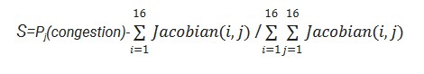
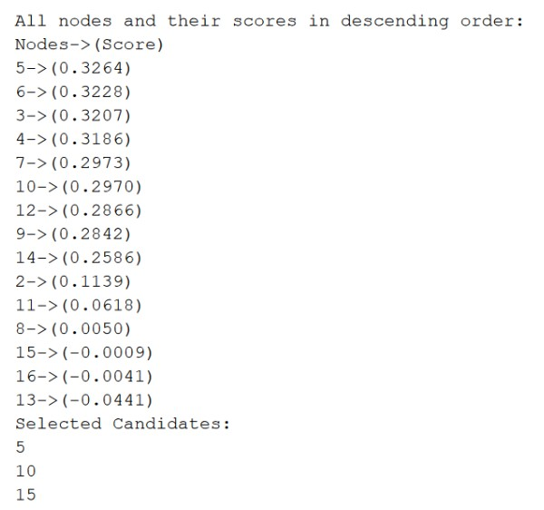
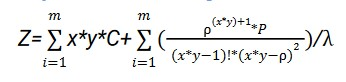

# EV Charging Station Optimization

This repository contains code for optimizing the placement and capacity of electric vehicle (EV) charging stations. The project focuses on two key objective functions to determine optimal locations and the number of charging points.

## Objective Functions

### Objective 1: Screening Candidate Locations for Charging Stations

- **Purpose**: Optimize candidate locations for EV charging stations by analyzing the power grid's voltage stability factor (VSF) and traffic congestion.
- **Techniques**:
  - **Traffic Congestion**: Modeled using a **Bayesian Network**.
  - **Voltage Stability Factor (VSF)**: Calculated using a **Forward-Backward Sweep** method.
  
#### Function Photo
 
Where P is for congestion and Jacobian Matrix is for VSF 

#### Result Photo
Results obtained from candidate selection

### Objective 2: Minimizing Cost and Waiting Time

- **Purpose**: Minimize the overall cost and waiting time at charging stations.
- **Techniques**:
  - **Queuing Theory**: Used to model waiting time.
  - **Teaching-Learning-Based Optimization (TLBO)**: Optimizes the number of charging stations and points at each location.

#### Function Photo
 
Where 
m= number of candidate locations 
x=Number of charging stations at each locations 
y=Number of charging points at each stations 
C=Total cost of charging stations 
ρ=Utilization rate of charging stations 
λ=Arrival rate of EVs in charging stations 
P=Probability of no EVs waiting in charging stations 

#### Result Photo
 
Results[x,y] 
Where 
x=Number of charging stations at each locations 
y=Number of charging points at each stations 

## For more detailed explanation access file named TP.pdf

## How to Run the Project

### Installation
1. Ensure MATLAB is installed on your system.
2. Clone this repository to your local machine
-Installation of EV charging Stations
The comments contain the information about which index in a given array/structure contains which info so all those can be changed accordingly.
1. Open all codes in matlab 
2. First run VSF code
3. Run congestion code
4. Run candidate code->Gives Candidate Locations
5. Run TBLO code->Gives number of charging stations per loaction and number of charging points per station
